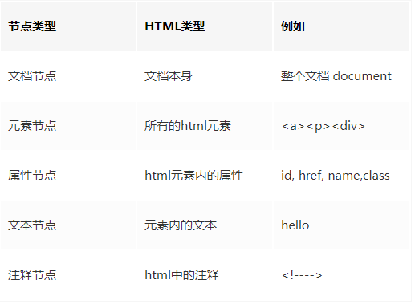

## BOM&DOM
- [BOM&DOM](#bomdom)
  - [1.BOM事件?](#1bom事件)
  - [2.常见BOM事件?](#2常见bom事件)
  - [3.BOM事件处理程序?](#3bom事件处理程序)
  - [4.BOM对象方法?](#4bom对象方法)
  - [5.BOM对象](#5bom对象)
    - [1.history](#1history)
    - [2.location](#2location)
    - [3.document](#3document)
  - [6.DOM?](#6dom)
  - [7.DOM节点](#7dom节点)
  - [8.DOM获取节点](#8dom获取节点)
  - [9.DOM创建节点与插入节点](#9dom创建节点与插入节点)
  - [10.DOM0级和DOM2级有什么区别](#10dom0级和dom2级有什么区别)
  - [11.textContent、innerText、innnerHTML、value的区别](#11textcontentinnertextinnnerhtmlvalue的区别)
  - [12.关于dom的api有什么](#12关于dom的api有什么)
  - [13.什么叫Dom事件流？](#13什么叫dom事件流)
  - [14.如何让事件先冒泡后捕获](#14如何让事件先冒泡后捕获)
  - [15.说一下事件代理](#15说一下事件代理)
  - [参考链接](#参考链接)


### 1.BOM事件?

事件就是用户或浏览器自身执行的某种动作.事件可能是用户在某些内容上的点击、鼠标经
过某个特定元素或按下键盘上的某些按键。事件还可能是 Web 浏览器中发生的事情，比如说某个 Web 页面加载完成，或者是用户滚动窗口或改变窗口大小。
通过使用 JavaScript ，你可以监听特定事件的发生，并规定让某些事件发生以对这些事件做出响应。
JavaScript可以处理的事件类型为：**鼠标事件、键盘事件、HTML事件**

### 2.常见BOM事件?

load：当页面或图像加载完后立即触发
blur：元素失去焦点
focus：元素获得焦点
click：鼠标点击某个对象
change：用户改变域的内容
mouseover：鼠标移动到某个元素上
mouseout：鼠标从某个元素上离开
keyup：某个键盘的键被松开
keydown：某个键盘的键被按下

### 3.BOM事件处理程序?

响应某个事件的函数就叫做事件处理程序（或事件侦听器）。事件处理程序的名字以“on”开头，因此click事件的事件处理程序就是onclick，为事件指定处理程序的方式有好几种

### 4.BOM对象方法?

这里主要说一下系统对话框:
浏览器通过（实际是window对象的方法）alert()、confirm()、prompt()方法可以调用系统对话框向用户显示消息

- 消息框:alert， 常用。
  alert() 方法用于显示带有一条指定消息和一个 OK 按钮的警告框。

- 输入框:prompt，返回提示框中的值。
  prompt() 方法用于显示可提示用户进行输入的对话框。
参数（可选）：第一个参数：要在对话框中显示的纯文本。第二个参数：默认的输入文本。

- 确认框:confirm，返回 true/false.
  confirm() 方法用于显示一个带有指定消息和 OK 及取消按钮的对话框。

### 5.BOM对象

#### 1.history

history 对象是历史对象。包含用户（在浏览器窗口中）访问过的 URL。history 对象是 window 对象的一部分，可通过 window.history 属性对其进行访问。
history对象的属性：length，返回浏览器历史列表中的 URL 数量。
history对象的方法：
  - back()：加载 history 列表中的前一个 URL。
  - forward()：加载历史列表中的下一个 URL。当页面第一次访问时，还没有下一个url。
  - go(number|URL): URL 参数使用的是要访问的 URL。而 number 参数使用的是要访问的 URL 在 History 的 URL 列表中的相对位置。go(-1)，到上一个页面

#### 2.location

location 对象是window对象之一，提供了与当前窗口中加载的文档有关的信息，还提供了一些导航功能。也可通过 window.location 属性来访问。

location 对象的属性href：设置或返回完整的 URL
location 对象的方法：
  - reload()：重新加载当前文档。
  - replace()：用新的文档替换当前文档。

#### 3.document

### 6.DOM?

DOM：Document Object Model 文档对象模型
要实现页面的动态交互效果，bom 操作远远不够，需要操作 html 才是核心。**如何操作 htm，就是 DOM。**
简单的说，dom 提供了用程序动态控制 html 接口。DOM即文档对象模型描绘了一个层次化的节点树，运行开发人员添加、移除和修改页面的某一部分。dom 处于javascript 的核心地位上。
每个载入浏览器的 HTML 文档都会成为 Document 对象。Document 对象使我们可以从脚本中对 HTML 页面中的所有元素进行访问。Document 对象是 Window 对象的一部分，可通过 window.document 属性对其进行访问。

### 7.DOM节点



### 8.DOM获取节点

获取节点的四种方法:
- getElementById()--通过id属性值获取元素对象
- getElementByName()--通过name属性值获取元素对象数组
- getElementByClass()--通过class属性值获取元素对象数组
- getElementByTagName()--通过元素名/标签名获取元素对象数

后三个获取的是数组,所以需要通过数组下标取值
注意:*操作dom节点是在等节点初始化完毕后*,才会执行
处理方式:
- 把script标签移到html末尾即可
- 使用onload事件来处理JS,等待html加载完毕再加载onload事件里的JS

### 9.DOM创建节点与插入节点

- 创建DOM节点
  使用的命令是
    ```js
    var oDiv = document.createElement('div');
    ```
    这样就创建了一个div标签。

- 插入DOM节点
  移动DOM节点也就是把这个节点插入到html文档中的某个地方，这里js给了我们两个方法：
  - 1.appendChild()：把节点插入到父节点的末尾。
  - document.body.appendChild(oDiv);   //把div插入到body中，并且位于末尾
  - 2.insertBefore()：把节点插入到父节点的某个兄弟节点的前面。

    ```js
    var oP = createElement('p');  //创建一个p节点
    document.body.insertBefore(oP,oDiv); //把p节点插入到div的前面
    ```
- 删除DOM节点
  删除DOM节点的方法是removeChild()。
  ```js 
  document.body.removeChild(oP);  //删除p节点
  ```
- 查找DOM节点
  查找DOM节点的方法很多，常用的有：
    ```js
    getElementById()    //通过元素Id，唯一性
    ```
如html文档如下：

    ```html
    <body>
        <div id='box'></div>
    </body>
    ```
1.使用getElementById()获取到id为box的div。

    ```js
    var oDiv = document.getElementById('box');
    ```
2.getElementsByTagName()   //通过元素的标签名来选择元素

    ```js
    var aDiv = getElementsByTagName('div');
    ```
要注意的是，getElementsByTagName()获取的是一组元素，所以如果想取得上面那个id为box的div要在后面加上[0];

    ```js
    var oDiv = getElementsByTagName('div')[0];
    ```
- 替换DOM节点
  替换DOM节点的方法是replaceChild()。

    ```js
    var oSpan = document.createElement('span'); //创建一个span标签
    document.body.replaceChild(oSpan,oBox); //用span标签替换div标签
    ```
### 10.DOM0级和DOM2级有什么区别

DOM0级中为某个dom元素绑定多个事件时，只有最后一个事件有效。onclick

DOM2级中可以为单个元素绑定多个事件，每个事件都可以被触发。addEventListener

### 11.textContent、innerText、innnerHTML、value的区别

- textContent用来获取和设置文本内容，与innerText的差别是:textContent获取到的内容包括了元素中的style标签和script标签的内容。
- innerText只能获取和设置文本内容，不能获取和设置html代码
- innerHTML可以获取和设置html代码
- value获取的是表单元素的值

### 12.关于dom的api有什么

https://www.cnblogs.com/betgar/articles/5084855.html

- 节点创建型api：

    document.createElement()
    document,createTextNode()
    parent.cloneNode(true)
    document.createDocumentFragment() 创建文档片段,解决大量添加节点造成的回流问题

- 页面修改型API：

    parent.appendChild(child)
    parent.insertBefore(newNode,referenceNode) 将新元素添加到父元素中指定的子元素前面
    parent.removeChild(child)
    parent.replcaeChild(newChild,oldChild)

- 节点查询型API：

    document.getElementById()
    document.getElementsByTagName() 返回的是一个即时的HTMLCollection类型
    document.getElementsByName() 根据指定的name属性获取元素,返回的是一个即时的NodeList
    document.getElementsByClassName() 返回的是一个即时的HTMLCollection
    document.querySelector() 获取匹配到的第一个元素，采用的是深度优先搜索。
    docuemnt.querySelectorAll()返回的是一个非即时的NodeList，也就是说结果不会随着文档树的变化而变化

- 节点关系型api：
  - 父关系型：
    node.parentNode()
  - 兄弟关系型
    node.previouSibling() 返回节点的前一个节点（包括元素节点，文本节点，注释节点）
    node.previousElementSibling() 返回前一个元素节点
    node.nextSibling() 返回下一个节点
    node.nextElementSibling() 返回下一个元素节点
  - 子关系型
    parent.childNodes() 返回一个即时的NodeList，包括了文本节点和注释节点
    parent.children() 一个即时的HTMLCollection，子节点都是Element
    parent.firsrtNode()
    parent.lastNode()
    hasChildNodes()

- 元素属性型api：

    element.setAttribute(“name”,“value”) 为元素添加属性
    element.getAtrribute(“name”) 获取元素的属性

- 元素样式型api：

    window.getComputedStyle(element) 返回一个CSSStyleDeclaration,可以从中访问元素的任意样式属性。
    element.getBoundingClientRect() 返回一个DOMRect对象，里面**⭐️ 包括了元素相对于可视区的位置top,left**,以及元素的大小,单位为纯数字。可用于判断某元素是否出现在了可视区域。

### 13.什么叫Dom事件流？

事件发生时会在元素节点之间按照特定的顺序传播，整个过程分为**捕获阶段，目标阶段和冒泡阶段**，这个传播过程叫做Dom事件流。

事件冒泡：从事件源**逐级向上**传播到DOM最顶层节点的过程。

事件捕获：从DOM最顶层节点**逐级向下**传播到事件源的过程。

addEventListener用于指定事件处理程序，共接收三个参数。分别是触发事件，事件处理程序函数以及一个布尔值。第三个参数**默认为false，表示**在该事件的处理函数会在**冒泡阶段被调用**。若改为true，则表示事件处理函数会在捕获阶段被调用。

**IE只支持事件冒泡。**

### 14.如何让事件先冒泡后捕获

原本的事件流中，是先捕获再冒泡。

- 对于目标元素来说，如果DOM节点通过**addEventListener**同时绑定了两个事件监听函数，一个用于捕获，一个用于冒泡，那么两个事件的执行顺序是按照代码添加的顺序执行的。所以，**先绑定冒泡的函数，再绑定捕获的函数**，即可实现。
  
- 对于非目标元素来说，可以**给捕获事件的处理程序添加一个定时器**，将处理程序推入下一个宏任务执行。

### 15.说一下事件代理

事件委托是指 不在子节点单独设置事件监听器，而将事件监听器设置在父节点上，再利用冒泡原理使每一个子节点都能触发该事件。

事件委托的优点：只操作一次Dom，提高了程序的性能。

常用于

- ul和li标签的事件监听，一般采用事件委托机制将事件监听器绑定在ul上。
  
- 还适合动态元素的绑定，新添加的子元素不需单独添加事件处理程序。

（1）了解事件代理吗，这样做有什么好处
事件代理/事件委托：利用了事件冒泡，只指定一个事件处理程序，就可以管理某一类型的事件，

简而言之：事件代理就是说我们将事件添加到本来要添加的事件的父节点，**将事件委托给父节点来触发处理函数**，这通常会使用在大量的同级元素需要添加同一类事件的时候，比如一个动态的非常多的列表，需要为每个列表项都添加点击事件，这时就可以使用事件代理，通过判断**e.target.nodeName来判断发生的具体元素**，这样做的好处是减少事件绑定，同事动态的DOM结构任然可以监听，**事件代理发生在冒泡阶段**

（2）事件委托以及冒泡原理:
事件委托是利用冒泡阶段的运行机制来实现的，就是把一个元素响应事件的函数委托到另一个元素，一般是把一组元素的事件委托到他的父元素上。

委托的优点是**减少内存消耗，节约效率**

动态绑定事件

事件冒泡，就是元素自身的事件被触发后，如果父元素有相同的事件，如onclick事件，那么元素本身的触发状态就会传递，也就是冒到父元素，父元素的相同事件也会一级一级根据嵌套关系向外触发，直到document/window，冒泡过程结束。

（3）事件代理在捕获阶段的实际应用：
可以在父元素层面阻止事件向子元素传播，也可代替子元素执行某些操作。


### 参考链接

https://blog.csdn.net/qq_41800649/article/details/108983069
